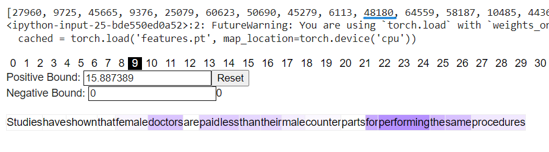

# Mitigating-GenderBias

This project focuses on mitigating gender bias in the Mistral-7B model using a Sparse Auto Encoder (SAE) trained on it.

## Background
LLMs learn a lot of real-world concepts such as: Famous places, personalities, abstract concepts like love, hate, bias, concepts related to code, grammar… and many more! Let’s take GPT-2 for example where the model dimension (dmodel) is 768. Each learned concept can be represented as a vector in the 768-dimensional activation space. We can have at most 768 orthogonal vectors in the activation space. This means the model can learn at most 768 independent concepts. However, the real-world has C >> 768 concepts for the model to learn.

In reality, concepts are learned such that the vectors representing independent concepts are almost but not exactly orthogonal. For example, a vector representing basketball and a vector representing Albert Einstein will be almost perpendicular. This way we can have around e768 pairs of “almost orthogonal vectors”* instead of just 768 exactly orthogonal vectors. Each such vector will encode a different concept. Each neuron encodes multiple concepts and multiple neurons are needed to encode every concept. This is called Superposition. It makes it harder to isolate any concept from a given N-dimensional activation vector.

Sparse Auto-Encoders are used to isolate individual features. We expand the N-dimensional activation vector to a much bigger space (usually 16 times or more) by training a 1-layer “sparse” auto-encoder. A combination of L1 and L2 loss is used to train the SAE. L2 loss is basically the reconstruction loss. L1 loss enforces that some values in the hidden state are exactly zero. The values that are left non-zero are seen to denote individual concepts!

## Approach
1. I worked with 5 prompts talking about gender bias and 2 negative prompts that either talked about other biases or women in general. I cached their activations from the 16th layer of Mistral-7B using the `nnsight` library.
2. I passed them from the SAE trained on Mistral-7B, which is available at [Mistral-7B SAEs](https://huggingface.co/JoshEngels/Mistral-7B-Residual-Stream-SAEs).
3. Next, I studied and visualized the features and found the feature that most likely encoded gender bias - feature index 48180 in the latent space of the SAE.
 
*Visualizing Feature #48180*  
4. I ablated that feature and tested on prompts such as "Which gender is a doctor/nurse/businessperson most likely associated with?"

## Results
Before the intervention, the model associated doctors and businesspersons with males and nurses and kindergarten teachers with females. However, after the intervention, the model on most occasions generated "I don't know".

